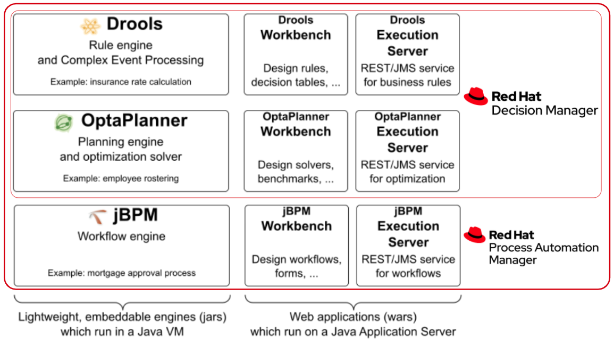

= Services
:jbake-description: Professional services for jBPM by Red Hat
:jbake-type: normalBase
:jbake-title: Services
:showtitle:

[.summaryParagraph]
https://www.redhat.com[Red Hat] sponsors this Open Source project
and employs its link:../community/team.html[core developers].
Additionally, Red Hat offers enterprise support and consultancy for the enterprise version of this community project,
as part of a Red Hat product subscription.

To assist customers, Red Hat employs:

- Solution architects that can define the best architecture for your scope and demonstrate the product functioning;
- Services team with consultants and architects to help deliver reliable production implementations with Red Hat PAM;
- A 24/7 support team.
- and of course the jBPM team itself to implement missing features or fix bugs.

== Community and product comparison

The community download delivers everything you would expect from an Open Source project,
including all features. The enterprise subscription fills the missing gaps for enterprise use. Both community and enterprise use the same code base.

If you are looking for a detailed explanation about how the community projects are different from the enterprise products check the **official https://www.redhat.com/en/resources/whats-the-difference-overview[Red Hat whitepaper]**. You can also check below an overview:

|===
| |Community |Enterprise subscription

|*Functionality* | |
|All features | Includes all enterprise features too |
|All bugfixes | Master branch only | Supported maintenance branches too
|Documentation | |
|Backport bugfixes to maintenance branches | Not released | Released in maintenance releases
|Security (CVE) watch for maintenance branches | Eventually released from master branch only | Released as backported bugfix

|*Testing* | |
|Unit testing | | On certification matrix
|Integration testing | | On certification matrix
|Stress testing | |
|Performance testing and sizing | |
|QA certification | | Cross matrix of OS's, JDK's, application containers, databases, ... See https://access.redhat.com/articles/3354301[supported configurations].

|*Help* | |
|Roadmap impact | Use link:../community/getHelp.html[our forum], #{site.issueTracker}[issue tracker] or send a link:../code/sourceCode.html[Pull Request] | Prioritized above community requests
|Public questions | Use link:../community/getHelp.html[Google Groups] | Or call 24/7 support instead
|Private 24/7 support | | https://access.redhat.com/support/contact/[By web or phone], guaranteed response time (SLA)
|Red Hat consultancy, training and POC assistance | | Talk to your account manager

|*Release schedule* | |
|Stable releases | Final usually every 3 weeks | GA every 3 months
|Maintenance releases | Use latest instead | Usually every 6 weeks
|One-off release for an urgent customer critical issue | | Also rolled up in the next maintenance release

|*Information* | |
|Open source (link:../code/license.html[Apache License 2.0]) | | but distribution available from customer portal only
|===

Subscribers have access to the product maven repository, with the productized binaries.
To migrate from the community to product binaries, simply add the customer maven repository
and adjust the version numbers to include the `-redhat` suffix.

== KIE features and the enterprise products overview

